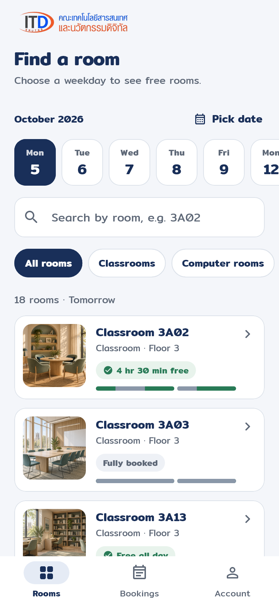
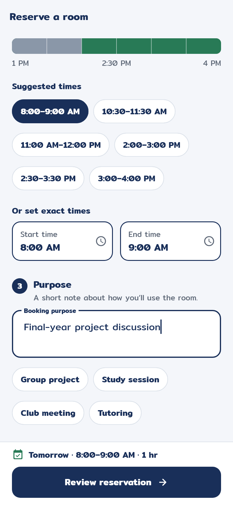
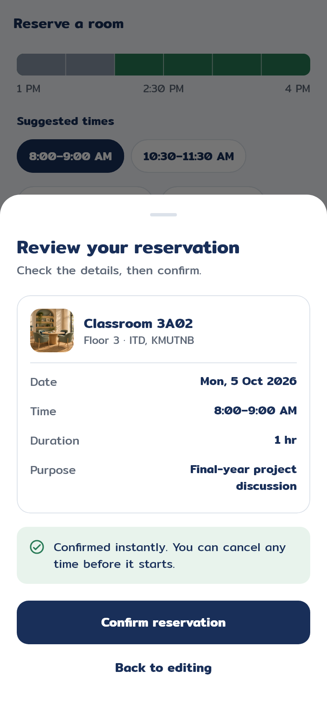
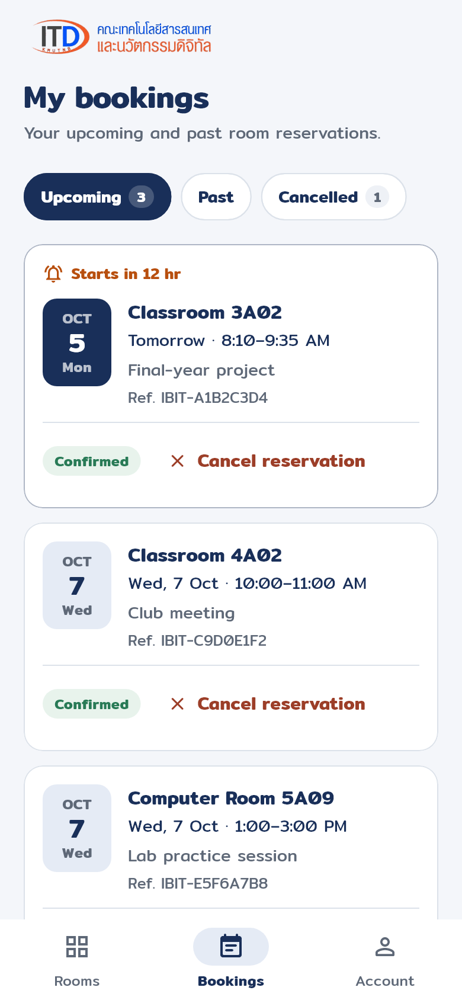

<div align="center">


# IBIT Rooms

**Find a free ITD room and reserve it in under a minute.**

[](https://docs.flutter.dev/)
[](https://firebase.google.com/docs/emulator-suite)
[](#quick-start)
[](#quick-start)

&nbsp;
&nbsp;
&nbsp;


</div>

## Contents

- [What it does](#what-it-does)
- [Quick start](#quick-start): run it on your computer from zero
- [Try it](#try-it)
- [Stop and start again](#stop-and-start-again)
- [If something goes wrong](#if-something-goes-wrong)
- [Advanced: live Firebase and APKs](#advanced-live-firebase-and-apks)
- [For developers](#for-developers)

## What it does

- **Browse 18 official ITD rooms** with photos and live availability for any weekday.
- **Reserve** any of the 13 classrooms and computer rooms for your own start and end time, Monday–Friday, **8:00 AM–12:00 PM** or **1:00–4:00 PM** (Bangkok time). The 5 preparation, server and exam rooms are information only.
- **Manage bookings:** see upcoming, past and cancelled bookings, and cancel any time before a booking starts.
- **Sign in** with email (with verification) or Google.

The server checks every booking: no weekends, past times, lunch-hour overlaps, double bookings or unverified accounts.

## Quick start

Everything runs **on your own computer**. You don't need a Firebase account, a Google Cloud project, billing, or the app installed anywhere. The steps are for **Windows 10/11 with PowerShell**; macOS and Linux users, see [this note](#macos-or-linux).

First, choose where you want to open the app:

| | **Option A: Browser** (easiest) | **Option B: Android emulator** |
| --- | --- | --- |
| You see the app in | Chrome or Edge | A virtual Android phone |
| Extra install | Java 21 | Android Studio (includes Java) |
| First start | ~1 minute | a few minutes (first Gradle build) |
| Best for | A quick look, reviewing the design | The real phone experience, native time picker |

### 1. Install the tools (once)

Open **PowerShell** and install what you don't have yet:

```powershell
winget install --id Git.Git -e
winget install --id OpenJS.NodeJS.22 -e
```

Then:

1. **Flutter 3.44 or newer:** follow the [Flutter quick install guide](https://docs.flutter.dev/install/quick) and add Flutter's `bin` folder to your `PATH`.
2. **Java (Firebase emulators need it):**
   - **Option A:** run `winget install --id Microsoft.OpenJDK.21 -e`
   - **Option B:** install Android Studio instead (`winget install --id Google.AndroidStudio -e`). It includes Java, and the scripts find it automatically.
3. **Firebase CLI:** close PowerShell, open a **new** window (so it sees Node.js), and run:

   ```powershell
   npm install -g firebase-tools
   ```

Check that everything is ready. Each command should print a version:

```powershell
git --version
flutter --version
node --version      # v22.x
firebase --version
java -version       # skip for Option B: Android Studio provides Java
```

> [!NOTE]
> For **Option A**, `flutter doctor` may warn about the Android toolchain. That's fine; you don't need it for the browser.

<details>
<summary><b>Option B only:</b> create a virtual Android phone</summary>

1. Open Android Studio → **More Actions → SDK Manager**. Install *Android SDK*, *Command-line Tools*, *Platform-Tools* and *Android Emulator*.
2. Run `flutter doctor --android-licenses` and accept the licenses.
3. In Android Studio, open **Device Manager**, create a phone with a **Google Play** system image, and press **Run ▶**.
4. Check that Flutter sees it: `flutter devices` should list something like `emulator-5554 • android-x64`.

</details>

### 2. Download the project

```powershell
git clone https://github.com/Tammarong/IBIT_APP.git
cd IBIT_APP
flutter pub get
npm --prefix functions ci
```

Windows blocks PowerShell scripts by default. Allow the project's scripts to run (once per computer):

```powershell
Set-ExecutionPolicy -Scope CurrentUser RemoteSigned
```

> [!TIP]
> Downloaded the ZIP from GitHub instead? Extract it, `cd` into the folder that contains `pubspec.yaml`, and run `Get-ChildItem -Recurse .\scripts | Unblock-File` once so Windows allows the scripts to run.

### 3. Start the local backend (terminal 1)

```powershell
.\scripts\start-emulators.ps1
```

Wait until it prints **`✔ All emulators ready!`**, then **leave this window open**. It runs Firebase Authentication, Realtime Database and the booking functions locally. The first start takes a little longer while it compiles the functions.

### 4. Open the app (terminal 2)

Open a **second** PowerShell window in the same folder.

**Option A: browser**

```powershell
.\scripts\run-web.ps1
```

It adds the 18 rooms if needed, then Chrome (or Edge) opens with the app after about a minute.

**Option B: Android emulator** (start the virtual phone first)

```powershell
.\scripts\run-android.ps1
```

It adds the 18 rooms if needed, then installs and opens the app on the virtual phone. If more than one Android device is connected, add `-Device emulator-5554` (use the ID from `flutter devices`).

## Try it

1. Tap **Try simulated Google account**. It's a ready-made, verified local test account, so you don't need a real Google login.
2. Pick a weekday, open a **Classroom** or **Computer room**, and tap **Reserve this room**.
3. Tap a **suggested time** (or set exact times), choose a purpose, then **Review reservation → Confirm reservation**.
4. Open **Bookings** to see it, or cancel it before it starts.

Want to see the data? The **Firebase Emulator UI** at <http://127.0.0.1:4000/> shows test users and bookings (`appData/rooms`, `appData/reservations`, `appData/roomDays`). It's local data on your computer, not the real Firebase Console.

<details>
<summary>Test email sign-up instead of the simulated account</summary>

Register with any email address in the app. Nothing is actually emailed in local mode. Mark the address as verified from another terminal:

```powershell
.\scripts\verify-local-email.ps1 -Email 'you@example.com'
```

Then tap **I've verified my email** in the app. Verification and password-reset links also appear in terminal 1 and the Emulator UI.

</details>

## Stop and start again

- **Stop the app:** press `q` in terminal 2.
- **Stop the backend:** press `Ctrl+C` in terminal 1. It saves your local test data to `.emulator-data` for next time.
- **Next time**, skip installation and repeat [steps 3 and 4](#3-start-the-local-backend-terminal-1).

## If something goes wrong

| What you see | What to do |
| --- | --- |
| `running scripts is disabled on this system` | Run the `Set-ExecutionPolicy` line from [step 2](#2-download-the-project), or start a script with `powershell -ExecutionPolicy Bypass -File .\scripts\start-emulators.ps1`. |
| `Install Java 21 or newer…` from `start-emulators.ps1` | Install Java (step 1) and open a **new** PowerShell window. |
| `Start Firebase emulators … first` | Terminal 1 must show **All emulators ready** before you run step 4. |
| Port `4000`, `5001`, `9000` or `9099` is already in use | An older backend is still running. Stop it with `Ctrl+C` (or close that window) and start again. |
| The app says the connection is not configured | The backend isn't running. Start step 3, then tap **Try again**. |
| **Option A:** sign-in shows `API key not valid` | Open the app at `http://localhost:…`, not `127.0.0.1`. `run-web.ps1` does this for you. |
| **Option A:** rooms show illustrations instead of photos | Expected. The ITD website doesn't allow other sites to load its photos in a browser. The Android app shows the real photos. |
| **Option B:** `No supported devices found` | Start the phone in Android Studio's Device Manager, then check `flutter devices`. |
| **Option B:** `INSTALL_FAILED_INSUFFICIENT_STORAGE` | The virtual phone is full. In Device Manager, choose **Wipe Data** for it, or uninstall old apps. |

## Advanced: live Firebase and APKs

The quick start is fully local. These optional modes use the existing Firebase project `ibit-rooms-20260914`.

<details>
<summary><b>Build a test APK (local mode)</b></summary>

```powershell
flutter build apk --debug --dart-define=FIREBASE_MODE=emulator
```

The APK is written to `build/app/outputs/flutter-apk/app-debug.apk`. It still needs the local backend (step 3) running whenever it's used.

</details>

<details>
<summary><b>Cloud mode:</b> browse rooms and sign in with the live Firebase project</summary>

The included `android/app/google-services.json` holds client configuration only, not administrator credentials.

```powershell
.\scripts\prepare-cloud-config.ps1   # creates the ignored firebase.cloud.json
.\scripts\run-cloud-android.ps1      # add -Device emulator-5554 if needed
```

- Email registration sends a **real** verification email.
- Google sign-in on a new computer needs that computer's debug SHA-1 and SHA-256 added to the Android app in Firebase Console. Get them with `.\android\gradlew.bat -p android signingReport`. See the [FlutterFire setup guide](https://firebase.google.com/docs/flutter/setup).
- **Reserve is disabled** in this mode, because the booking functions aren't deployed (deploying requires the paid Blaze plan).
- Build its APK with `.\scripts\build-cloud-apk.ps1` → `artifacts/ibit-rooms-live-debug.apk`.

</details>

<details>
<summary><b>Hybrid mode:</b> live accounts and rooms, with the booking server on your computer</summary>

Live Firebase Authentication and Realtime Database, while only the booking functions run locally. This is for testing on an Android emulator on that computer; it isn't a public booking service. It needs a Google account with administrator access to `ibit-rooms-20260914`.

1. Run `.\scripts\prepare-cloud-config.ps1`. Install the [Google Cloud CLI](https://docs.cloud.google.com/sdk/docs/install-sdk), then run `gcloud auth application-default login YOUR_PROJECT_ADMIN_EMAIL --disable-quota-project`. This does **not** enable billing; ignore any Google Cloud free-trial page. Never put credentials or service-account keys in the app or repository.
2. **Terminal 1:** `.\scripts\start-hybrid-functions.ps1`. It builds the functions, checks live database access, and starts only the Functions emulator on port `5001`. Don't also run `start-emulators.ps1`.
3. **Once**, when the server is ready, run `.\scripts\enable-hybrid-booking.ps1` in terminal 2. It only flips `bookingEnabled` for the 13 bookable rooms, and stops without changes if the server isn't healthy.
4. Start the Android emulator, then run `.\scripts\run-hybrid-android.ps1` (add `-Device …` if needed). Bookings appear in the [live Realtime Database](https://console.firebase.google.com/project/ibit-rooms-20260914/database/ibit-rooms-20260914-default-rtdb/data).

Build a hybrid APK with `.\scripts\build-hybrid-apk.ps1` → `artifacts/ibit-rooms-hybrid-debug.apk`. The APK alone isn't enough: the local server must be running when the app opens (the emulator reaches it at `10.0.2.2:5001`; keep port `5001` bound to localhost). Direct app writes to reservations stay denied by `database.rules.json`, and the local server verifies live Firebase ID tokens.

If the server says live database access failed, check which Google account Application Default Credentials use. A Google Cloud free trial is **not** required.

</details>

The project stays on the free **Spark** plan. Local emulation doesn't need Blaze; only [deploying Cloud Functions](https://firebase.google.com/docs/functions/get-started) does.

## For developers

### Checks

```powershell
flutter analyze
flutter test                        # widget and unit tests, incl. 320×568 at 200% text
.\scripts\test-backend.ps1          # booking rules and concurrency (stop the emulators first,
                                    # or add -UseRunningEmulators)
.\scripts\design-preview.ps1        # renders every screen to build/design_preview/*.png
```

[VERIFICATION.md](VERIFICATION.md) records tested scenarios, including the Android end-to-end flow, and [functions/README.md](functions/README.md) documents the backend.

### Project layout

```text
lib/
  core/          design tokens and theme, booking-time rules, Firebase setup
  data/          models and Firebase repositories
  features/      auth, rooms, reservations, account screens
  widgets/       shared UI: cards, status pills, date strip, availability timeline
functions/       booking callables (TypeScript), seed and migration scripts
scripts/         one-command PowerShell helpers used in this README
test/            unit, widget and design-preview tests
integration_test/  Android end-to-end flow against the emulators
.claude/skills/design/  the app's UI/UX design system and review workflow
```

### How bookings work

- Realtime Database separates editable `appData/rooms/{roomId}`, private `appData/reservations/{id}`, and shared `appData/roomDays/{date}/{roomId}` availability. Shared availability holds only opaque IDs and times, never another user's identity or purpose.
- The backend books inside an atomic transaction with idempotent request IDs, so a retried request can't double-book. Cancelling releases the time. Adjacent bookings are allowed; times are whole minutes.
- The app has no payments, recurring bookings, notifications or admin dashboard.

### Design system

UI work follows the project skill in [.claude/skills/design/SKILL.md](.claude/skills/design/SKILL.md): tokens in `lib/core/theme.dart`, shared components in `lib/widgets/`, UX and accessibility rules, and the screenshot review workflow. In Claude Code, run `/design`.

### macOS or Linux

The scripts are written for Windows PowerShell, but the steps are the same. Install the same tools, then:

```bash
# terminal 1: local backend
npm --prefix functions run build
firebase emulators:start --project demo-ibit-reservations --only auth,database,functions \
  --export-on-exit .emulator-data   # add --import .emulator-data on later runs

# terminal 2: seed rooms, then open the app in Chrome
npm --prefix functions run seed
flutter run -d chrome --web-hostname localhost --web-port 8686 --dart-define=FIREBASE_MODE=emulator
```

## Credits

Room names and photo URLs come from the ITD [classroom](https://www.itd.kmutnb.ac.th/class-room.php) and [computer-room](https://www.itd.kmutnb.ac.th/computer-room.php) pages; unknown capacities and equipment are deliberately left out. The ITD wordmark and emblem are the faculty's official artwork (see [assets/branding](assets/branding/README.md)). Fallback room illustrations are AI-generated placeholders (see [assets/README.md](assets/README.md)). The Mitr typeface is licensed under the [SIL Open Font License](assets/fonts/OFL.txt).
